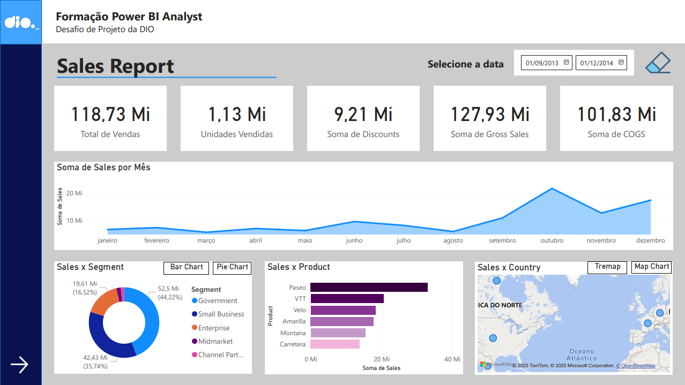
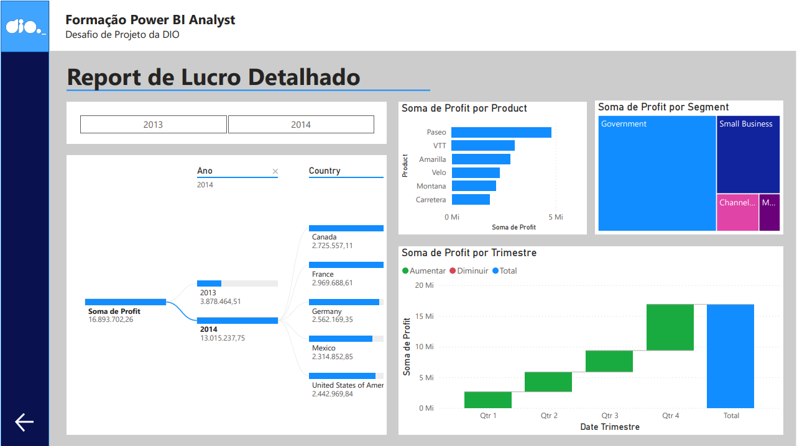

# Relatório Gerencial de Vendas com Power BI

## 📋 Descrição
Projeto prático feito na plataforma DIO em parceria com a Randstad com o objetivo de criar um relatório com base na sample financials do Power BI.

## 🎯 Objetivo
- Estabelecer uma estrutura clara e organizada para a interface
- Implementar botões de navegação que garantam uma experiência intuitiva e fluida
- Utilizar segmentadores e botões com imagens associadas para facilitar a identificação visual
- Permitir a seleção de diferentes visuais sobre um mesmo tema por meio de indicadores e botões interativos

## 🛠️ Ferramentas
- [Power BI](https://www.microsoft.com/pt-br/power-platform/products/power-bi)

## 📈 Visualização Final do Projeto

